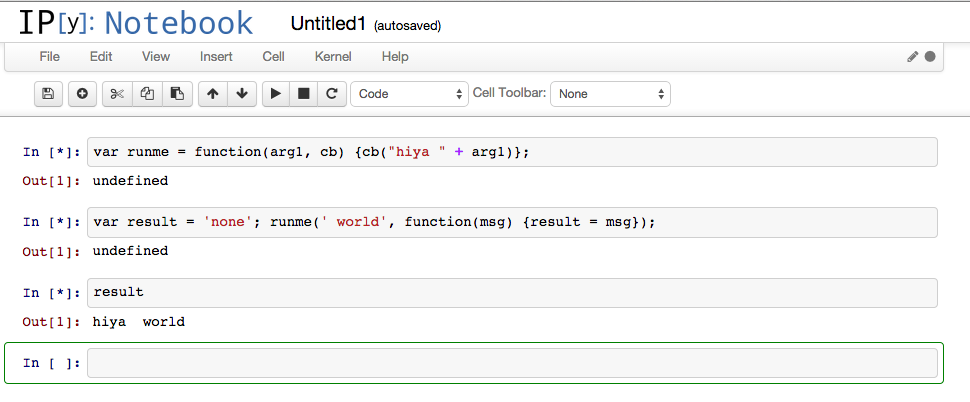

node-kernel
===========

A [node.js](http://nodejs.org/) kernel for [ipython](http://ipython.org/).



_created from from Matthias Bussonnier's gist https://gist.github.com/Carreau/4279371_

_**PLEASE CHECK OUT A MORE COMPLETE AND BETTER MAINTAINED IMPLEMENTATION at https://github.com/n-riesco/ijavascript**_

##INSTALL

Assumes you have already installed [ipython](http://ipython.org), [node.js](http://nodejs.org), and [zeromq](http://zeromq.org/). OSX hint: "`brew install zeromq && pip install ipython`"

1. clone from github _(I clone it in ~/)_
    ```    
    git clone git@github.com:navicore/node-kernel.git
    ```    

1. run 
    ```
    cd node-kernel
    npm install
    ```
1. run _(I always run it from ~ but don't know if it matters)_
    ```
    ipython profile create node
    ```

1. add the following to `~/.ipython/profile_node/ipython_notebook_config.py` and note the CHANGE PATH instruction.
    ```
    c = get_config()
    c.ZMQInteractiveShell.debug = True
    c.ZMQInteractiveShell.pdb = True
    #<CHANGE PATH TO kernel.js BELOW> currently pointing to ~/node-kernel.  Chang    e this to where ever you cloned the node-kernel.git repo in step 1.
    c.KernelManager.kernel_cmd = ["/usr/local/bin/node", "--debug",
                                  "node-kernel/kernel.js", "{connection_file}"]
    c.Session.key = ''
    c.Session.debug = True
    c.Session.keyfile = ''
    ```

1. run _(I run from ~ so that it finds my saved notebooks)_
    ```
    ipython notebook --profile=node
    ```

1. [click](http://localhost:8888)

##USAGE

1. click the "New Notebook" button

1. define a function with a callback
    ```
    var runme = function(arg1, cb) {cb("hiya " + arg1)};
    ```

1. mouse click the run button

1. define a result var and call the function with a callback
    ```
    var result = 'none'; runme(' world', function(msg) {result = msg});
    ```

1. mouse click the run button

1. print the variable
    ```
    result
    ```

1. mouse click the run button

